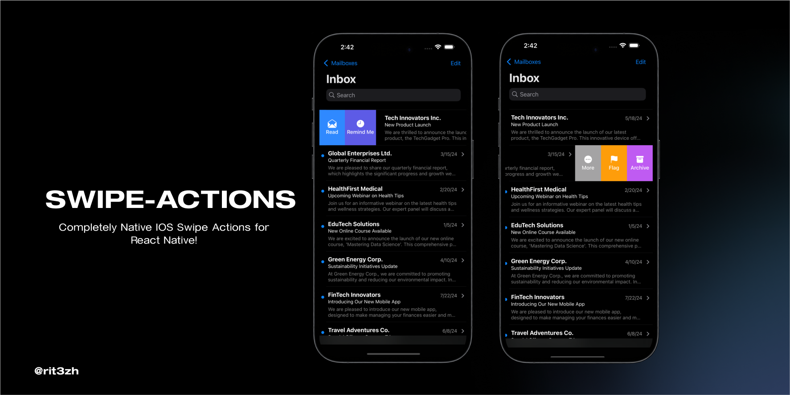

# React Native IOS Swipe Actions

  
  
  

  <h3>
    Native IOS Swipe Actions for react-native with configurable options 🚀
  </h3>

import { Callout } from "nextra/components";

<Callout type="info" emoji="ℹ️">
  This library relies on Expo Modules Code, and thus requires Expo to be
  installed.
</Callout>
